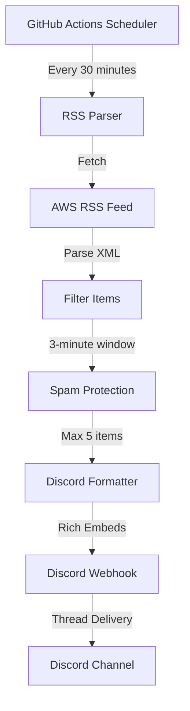

# AWS RSS to Discord Bot


An automated monitoring system that delivers real-time AWS service announcements directly to your Discord server. This bot tracks the official AWS "What's New" RSS feed and sends formatted notifications to a designated Discord thread, ensuring your team stays informed about the latest AWS updates, feature releases, and regional expansions.

## 🌟 Features

### Core Functionality
- **🔄 Automated Monitoring**: Checks AWS RSS feed every 30 minutes via GitHub Actions
- **🎯 Thread-Specific Delivery**: Sends messages to a dedicated Discord thread for organized notifications
- **🚫 Duplicate Prevention**: Advanced time-based filtering prevents repeated notifications
- **📱 Rich Formatting**: Beautiful Discord embeds with AWS branding and metadata
- **🌍 Timezone Support**: Displays timestamps in Bangkok timezone for local relevance
- **📊 Comprehensive Logging**: Detailed execution logs for monitoring and debugging

### Smart Filtering & Protection
- **⏱️ Time-Window Filtering**: Only processes items from the last 3 minutes to ensure freshness
- **🛡️ Spam Protection**: Limits maximum 5 items per execution to prevent channel flooding
- **⚡ Rate Limiting**: 2-second delays between messages to respect Discord API limits
- **🔍 Content Validation**: Validates timestamps and content integrity before delivery

### Enterprise-Ready
- **🔐 Secure Configuration**: Uses GitHub Secrets for sensitive data management
- **🚨 Error Handling**: Comprehensive error catching with detailed logging
- **📈 Scalable Architecture**: Designed for reliable long-term operation
- **🔧 Easy Maintenance**: Self-documenting code with extensive inline documentation

## 📋 Prerequisites

Before setting up this bot, ensure you have:

- **GitHub Account**: For hosting the GitHub Actions workflow
- **Discord Server**: With permission to create webhooks and threads
- **Basic Git Knowledge**: For repository management and configuration

## 🚀 Quick Start

### Step 1: Repository Setup

1. **Fork or Clone this Repository**
   ```bash
   git clone https://github.com/your-username/aws-discord-notifier.git
   cd aws-discord-notifier
   ```

2. **Create the Workflow File**
   - Create directory: `.github/workflows/`
   - Add the workflow file: `aws-rss.yml`
   - Copy the complete workflow code into this file

### Step 2: Discord Configuration

1. **Create a Discord Thread**
   ```
   • Go to your desired Discord channel
   • Send any message (e.g., "AWS Updates Thread")
   • Right-click the message → "Create Thread"
   • Name it: "AWS What's New Updates"
   • Note the thread URL
   ```

2. **Extract Thread ID**
   ```
   From URL: https://discord.com/channels/SERVER_ID/CHANNEL_ID/THREAD_ID
   Copy the THREAD_ID (last number sequence)
   ```

3. **Create Discord Webhook**
   ```
   • Channel Settings → Integrations → Webhooks
   • Create Webhook
   • Name: "AWS Updates"
   • Copy Webhook URL
   ```

### Step 3: GitHub Secrets Configuration

Navigate to your repository: **Settings** → **Secrets and variables** → **Actions**

Add these repository secrets:

| Secret Name | Description | Example Value |
|-------------|-------------|---------------|
| `DISCORD_WEBHOOK_URL` | Discord webhook endpoint | `https://discord.com/api/webhooks/123.../abc...` |
| `THREAD_ID` | Discord thread identifier | `1234567890123456789` |

### Step 4: Activation

1. **Commit and Push** your workflow file to the repository
2. **Verify Setup**: Go to **Actions** tab and check for the workflow
3. **Manual Test**: Click **Run workflow** to test the setup
4. **Monitor Logs**: Check the execution logs for any errors

## ⚙️ Configuration

### Execution Schedule

The bot runs every 30 minutes by default. To modify the schedule:

```yaml
schedule:
  - cron: '*/30 * * * *'  # Every 30 minutes
  # - cron: '*/15 * * * *'  # Every 15 minutes
  # - cron: '0 * * * *'     # Every hour
```

### Spam Protection Limits

Adjust the maximum items per execution:

```javascript
const MAX_ITEMS_PER_EXECUTION = 5;  // Default: 5 items
```

### Time Window Filtering

Modify the freshness threshold:

```javascript
const cutoffTime = new Date(now.getTime() - 3 * 60 * 1000);  // Default: 3 minutes
```

### Timezone Display

Change the display timezone:

```javascript
timeZone: 'Asia/Bangkok'  // Default: Bangkok
// timeZone: 'America/New_York'
// timeZone: 'Europe/London'
```

## 🔧 How It Works

### Architecture Overview



### Execution Flow

1. **Scheduled Trigger**: GitHub Actions initiates execution every 30 minutes
2. **RSS Retrieval**: Fetches the latest AWS announcements from the official feed
3. **Time Filtering**: Analyzes publication timestamps to identify new content
4. **Content Validation**: Verifies item integrity and applies spam protection
5. **Message Formatting**: Creates rich Discord embeds with AWS branding
6. **Thread Delivery**: Sends formatted messages to the designated Discord thread
7. **Logging**: Records execution details for monitoring and debugging

### Duplicate Prevention Strategy

The bot uses **temporal proximity analysis** instead of traditional caching:

- **Time Window**: Only processes items from the last 3 minutes
- **Execution Frequency**: Runs every 30 minutes with overlap coverage
- **Natural Expiration**: Old items automatically "expire" out of the window
- **No Storage Required**: Eliminates cache management complexity

## 📊 Expected Behavior

### Normal Operation
```
📅 Typical Day:
├── 09:00 → 0 items (no new announcements)
├── 09:30 → 0 items (quiet period)
├── 10:00 → 1 item (new EC2 feature)
├── 10:30 → 0 items (no updates)
└── 11:00 → 2 items (S3 and Lambda updates)
```

### High-Activity Periods
```
📈 AWS Conference Days (re:Invent):
├── Multiple announcements per hour
├── Spam protection activates (5 item limit)
├── Excess items logged but not sent
└── Prevents Discord channel flooding
```

## 🐛 Troubleshooting

### Common Issues

#### No Messages Received
**Symptoms**: Workflow runs successfully but no Discord messages appear

**Solutions**:
1. Verify `DISCORD_WEBHOOK_URL` is correct and active
2. Check `THREAD_ID` matches your Discord thread
3. Confirm webhook permissions in Discord
4. Review GitHub Actions logs for error messages

#### Duplicate Messages
**Symptoms**: Same announcement appears multiple times

**Solutions**:
1. Check if multiple workflows are running simultaneously
2. Verify time window filtering is working (check logs)
3. Ensure only one instance of the workflow exists

#### Missing Recent Announcements
**Symptoms**: New AWS announcements don't appear in Discord

**Solutions**:
1. Verify AWS RSS feed accessibility
2. Check if announcements fall within 3-minute window
3. Review spam protection logs for filtering details

### Debug Mode

Enable verbose logging by adding debug statements:

```javascript
// Add after feed parsing
console.log('🔍 Debug: Raw feed items:', feed.items.slice(0, 3));
console.log('🔍 Debug: Time filtering details:', { now, cutoffTime });
```

### Log Analysis

Monitor these key log messages:

- `✅ Successfully delivered to Discord`: Successful message delivery
- `⚠️ SPAM PROTECTION ACTIVATED`: Too many items filtered to 5
- `📭 No qualifying items found`: No new content in time window
- `❌ CRITICAL ERROR`: System-level failures requiring attention

## 🔒 Security Considerations

### Secret Management
- **Never commit secrets** to the repository
- **Use GitHub Secrets** for all sensitive configuration
- **Regularly rotate** Discord webhook URLs if compromised
- **Review access permissions** periodically

### Webhook Security
- **Limit webhook scope** to specific channels only
- **Monitor webhook usage** through Discord audit logs
- **Revoke unused webhooks** to reduce attack surface

## 📈 Performance & Limits

### GitHub Actions Quotas
- **Public Repositories**: Unlimited GitHub Actions minutes
- **Private Repositories**: 2,000 minutes/month (free tier)
- **Current Usage**: ~1-2 minutes per month for this workflow

### Discord API Limits
- **Webhook Rate Limit**: 30 requests per minute
- **Our Implementation**: 1 request per 2 seconds (well under limit)
- **Message Size Limit**: 2000 characters (our embeds: ~800 characters)

## 🤝 Contributing

We welcome contributions! Please see our contributing guidelines:

### Development Setup
1. Fork the repository
2. Create a feature branch: `git checkout -b feature/amazing-feature`
3. Make your changes with proper documentation
4. Test thoroughly with manual workflow runs
5. Submit a pull request with detailed description

### Code Standards
- **Comment extensively** for complex logic
- **Follow existing naming conventions**
- **Include error handling** for all external API calls
- **Test edge cases** thoroughly
- **Update documentation** for new features

## 📝 License

This project is licensed under the MIT License - see the [LICENSE](LICENSE) file for details.

## 🙏 Acknowledgments

- **AWS** for providing the comprehensive RSS feed
- **Discord** for the robust webhook API
- **GitHub Actions** for reliable automation platform
- **Node.js Community** for excellent RSS parsing libraries

## 📞 Support

- **Issues**: [GitHub Issues](https://github.com/your-username/aws-discord-notifier/issues)
- **Discussions**: [GitHub Discussions](https://github.com/your-username/aws-discord-notifier/discussions)
- **Documentation**: This README and inline code comments

---

**Made with ❤️ for the AWS Community**

*Stay updated with the latest AWS announcements effortlessly!*
