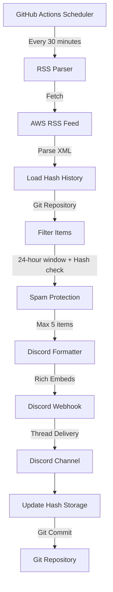

# AWS RSS to Discord Bot


An automated monitoring system that delivers real-time AWS service announcements directly to your Discord server. This bot tracks the official AWS "What's New" RSS feed and sends formatted notifications to a designated Discord thread, ensuring your team stays informed about the latest AWS updates, feature releases, and regional expansions.

## 🌟 Features

### Core Functionality
- **🔄 Automated Monitoring**: Checks AWS RSS feed every 30 minutes via GitHub Actions
- **🎯 Thread-Specific Delivery**: Sends messages to a dedicated Discord thread for organized notifications
- **🚫 Advanced Duplicate Prevention**: Content-hash based deduplication with persistent storage
- **📱 Rich Formatting**: Beautiful Discord embeds with AWS branding and metadata
- **🌍 Timezone Support**: Displays timestamps in localized format for better readability
- **📊 Comprehensive Logging**: Detailed execution logs for monitoring and debugging

### Smart Filtering & Protection
- **⏱️ Extended Time-Window Filtering**: Processes items from the last 24 hours to handle RSS feed inconsistencies
- **🔑 Content Hash Deduplication**: SHA256-based unique identification prevents duplicate messages
- **🛡️ Spam Protection**: Limits maximum 5 items per execution to prevent channel flooding
- **⚡ Rate Limiting**: 2-second delays between messages to respect Discord API limits
- **🔍 Content Validation**: Validates timestamps and content integrity before delivery

### Enterprise-Ready
- **💾 Persistent Storage**: Uses Git repository to store sent message hashes across workflow runs
- **🔐 Secure Configuration**: Uses GitHub Secrets for sensitive data management
- **🚨 Error Handling**: Comprehensive error catching with detailed logging
- **📈 Scalable Architecture**: Designed for reliable long-term operation
- **🔧 Easy Maintenance**: Self-documenting code with extensive inline documentation
- **🧹 Auto-cleanup**: Automatically removes hash records older than 7 days

## 📋 Prerequisites

Before setting up this bot, ensure you have:

- **GitHub Account**: For hosting the GitHub Actions workflow
- **Discord Server**: With permission to create webhooks and threads
- **Basic Git Knowledge**: For repository management and configuration

## 🚀 Quick Start

### Step 1: Repository Setup

1. **Fork or Clone this Repository**
   ```bash
   git clone https://github.com/your-username/aws-discord-notifier.git
   cd aws-discord-notifier
   ```

2. **Create the Workflow File**
   - Create directory: `.github/workflows/`
   - Add the workflow file: `aws-rss.yml`
   - Copy the complete workflow code into this file

### Step 2: Discord Configuration

1. **Create a Discord Thread**
   ```
   • Go to your desired Discord channel
   • Send any message (e.g., "AWS Updates Thread")
   • Right-click the message → "Create Thread"
   • Name it: "AWS What's New Updates"
   • Note the thread URL
   ```

2. **Extract Thread ID**
   ```
   From URL: https://discord.com/channels/SERVER_ID/CHANNEL_ID/THREAD_ID
   Copy the THREAD_ID (last number sequence)
   ```

3. **Create Discord Webhook**
   ```
   • Channel Settings → Integrations → Webhooks
   • Create Webhook
   • Name: "AWS Updates"
   • Copy Webhook URL
   ```

### Step 3: GitHub Secrets Configuration

Navigate to your repository: **Settings** → **Secrets and variables** → **Actions**

Add these repository secrets:

| Secret Name | Description | Example Value |
|-------------|-------------|---------------|
| `DISCORD_WEBHOOK_URL` | Discord webhook endpoint | `https://discord.com/api/webhooks/123.../abc...` |
| `THREAD_ID` | Discord thread identifier | `1234567890123456789` |

### Step 4: Repository Permissions

**Important**: Ensure GitHub Actions can commit to your repository:

1. Go to **Settings** → **Actions** → **General**
2. Under **Workflow permissions**, select:
   - ✅ **Read and write permissions**
   - ✅ **Allow GitHub Actions to create and approve pull requests**

### Step 5: Activation

1. **Commit and Push** your workflow file to the repository
2. **Verify Setup**: Go to **Actions** tab and check for the workflow
3. **Manual Test**: Click **Run workflow** to test the setup
4. **Monitor Logs**: Check the execution logs for any errors
5. **Verify Hash File**: After first run, check that `sent_messages_hashes.json` is created

## ⚙️ Configuration

### Execution Schedule

The bot runs every 30 minutes by default. To modify the schedule:

```yaml
schedule:
  - cron: '*/30 * * * *'  # Every 30 minutes
  # - cron: '*/15 * * * *'  # Every 15 minutes
  # - cron: '0 * * * *'     # Every hour
```

### Spam Protection Limits

Adjust the maximum items per execution:

```javascript
const MAX_ITEMS_PER_EXECUTION = 5;  // Default: 5 items
```

### Time Window Filtering

Modify the freshness threshold:

```javascript
const cutoffTime = new Date(now.getTime() - 24 * 60 * 60 * 1000);  // Default: 24 hours
```

### Hash Cleanup Period

Change how long to keep sent message records:

```javascript
const oneWeekAgo = new Date(Date.now() - 7 * 24 * 60 * 60 * 1000);  // Default: 7 days
```

## 🔧 How It Works

### Architecture Overview


```mermaid
graph TD
    A[GitHub Actions Scheduler] -->|Every 30 minutes| B[RSS Parser]
    B -->|Fetch| C[AWS RSS Feed]
    C -->|Parse XML| D[Load Hash History]
    D -->|Git Repository| E[Filter Items]
    E -->|24-hour window + Hash check| F[Spam Protection]
    F -->|Max 5 items| G[Discord Formatter]
    G -->|Rich Embeds| H[Discord Webhook]
    H -->|Thread Delivery| I[Discord Channel]
    I --> J[Update Hash Storage]
    J -->|Git Commit| K[Git Repository]
```

### Execution Flow

1. **Scheduled Trigger**: GitHub Actions initiates execution every 30 minutes
2. **Hash Loading**: Loads previously sent message hashes from `sent_messages_hashes.json`
3. **RSS Retrieval**: Fetches the latest AWS announcements from the official feed
4. **Dual Filtering**: Applies both time-based (24-hour window) and hash-based deduplication
5. **Content Validation**: Verifies item integrity and applies spam protection
6. **Message Formatting**: Creates rich Discord embeds with AWS branding
7. **Thread Delivery**: Sends formatted messages to the designated Discord thread
8. **Hash Storage**: Records successful deliveries and commits to repository
9. **Cleanup**: Automatically removes hash records older than 7 days

### Advanced Duplicate Prevention Strategy

The bot uses a **two-layer deduplication system**:

#### Layer 1: Time-based Filtering
- **Extended Time Window**: Processes items from the last 24 hours (not 3 minutes)
- **Handles RSS Inconsistencies**: Accounts for stale publication dates in AWS feed
- **Flexible Coverage**: Ensures no announcements are missed due to timing issues

#### Layer 2: Content Hash Deduplication
- **Unique Identification**: Generates SHA256 hash from `title + link + publication date`
- **Persistent Storage**: Stores sent message hashes in Git repository
- **Cross-session Memory**: Remembers sent messages between workflow executions
- **Automatic Cleanup**: Removes old hashes after 7 days to prevent file bloat

#### Hash File Structure
```json
{
  "535ee5c1c3602c62": "2025-07-27T13:08:58.119Z",
  "abc123def4567890": "2025-07-28T10:30:00.000Z",
  "xyz789uvw1234567": "2025-07-28T14:15:00.000Z"
}
```

## 📊 Expected Behavior

### Normal Operation
```
📅 Typical Day:
├── 09:00 → 0 items (no new announcements)
├── 09:30 → 0 items (quiet period) 
├── 10:00 → 1 item (new EC2 feature) → Hash saved
├── 10:30 → 0 items (duplicate detected)
└── 11:00 → 2 items (S3 and Lambda updates) → Hashes updated
```

### High-Activity Periods
```
📈 AWS Conference Days (re:Invent):
├── Multiple announcements per hour
├── Spam protection activates (5 item limit)
├── Excess items logged but not sent
├── All successful deliveries hashed
└── Prevents Discord channel flooding
```

### Hash File Evolution
```
📈 Hash File Growth:
├── Day 1: 3 hashes (3 announcements)
├── Day 2: 7 hashes (4 new announcements)
├── Day 7: 25 hashes (peak activity)
├── Day 8: 20 hashes (auto-cleanup removes old entries)
└── Steady state: ~15-30 hashes typically
```

## 🐛 Troubleshooting

### Common Issues

#### No Messages Received
**Symptoms**: Workflow runs successfully but no Discord messages appear

**Solutions**:
1. Verify `DISCORD_WEBHOOK_URL` is correct and active
2. Check `THREAD_ID` matches your Discord thread
3. Confirm webhook permissions in Discord
4. Review GitHub Actions logs for error messages
5. Check if items are being filtered by time window (24-hour limit)

#### Duplicate Messages Still Appearing
**Symptoms**: Same announcement appears multiple times despite hash system

**Solutions**:
1. Check if `sent_messages_hashes.json` file exists in repository
2. Verify GitHub Actions has write permissions to repository
3. Review "Commit hash file" step logs for git errors
4. Ensure no multiple workflow instances are running
5. Check if hash file is being committed successfully

#### Hash File Not Created/Updated
**Symptoms**: `sent_messages_hashes.json` remains empty or unchanged

**Solutions**:
1. **Check Repository Permissions**: Settings → Actions → General → "Read and write permissions"
2. **Review Git Step Logs**: Look for push failures or commit errors
3. **Manual File Creation**: Create empty `{}` file if needed
4. **Branch Protection**: Ensure GitHub Actions can push to main branch

#### Missing Recent Announcements
**Symptoms**: New AWS announcements don't appear in Discord

**Solutions**:
1. Verify AWS RSS feed accessibility
2. Check if announcements fall within 24-hour window
3. Review spam protection logs for filtering details
4. Ensure Discord webhook is not rate-limited

### Debug Mode

Enable verbose logging by adding debug statements:

```javascript
// Add after hash loading
console.log('🔍 Debug: Loaded hashes:', Object.keys(sentHashes));
console.log('🔍 Debug: Time filtering details:', { now, cutoffTime });

// Add after filtering
console.log('🔍 Debug: Items after filtering:', newItems.length);
```

### Log Analysis

Monitor these key log messages:

- `📚 Loaded X hash records from storage`: Hash file loading status
- `🚫 DUPLICATE DETECTED`: Successful duplicate prevention
- `✅ Successfully delivered to Discord`: Successful message delivery
- `💾 Saved X hash records to storage`: Hash file update
- `⚠️ SPAM PROTECTION ACTIVATED`: Too many items filtered to 5
- `📭 No new items found`: No new content in time window
- `❌ CRITICAL ERROR`: System-level failures requiring attention

### Git Integration Debugging

Check these specific logs in "Commit hash file" step:

```bash
📁 Hash file found, checking contents...
📄 File contents: {"hash": "timestamp"}
📊 Git status before adding file: 
💾 File has changes, committing...
🚀 Attempting to push to repository...
✅ Successfully pushed hash file to repository
```

## 🔒 Security Considerations

### Secret Management
- **Never commit secrets** to the repository
- **Use GitHub Secrets** for all sensitive configuration
- **Regularly rotate** Discord webhook URLs if compromised
- **Review access permissions** periodically

### Webhook Security
- **Limit webhook scope** to specific channels only
- **Monitor webhook usage** through Discord audit logs
- **Revoke unused webhooks** to reduce attack surface

### Repository Security
- **Monitor hash file commits** for unusual activity
- **Review workflow permissions** regularly
- **Use branch protection** if needed (with Actions bypass)

## 📈 Performance & Limits

### GitHub Actions Quotas
- **Public Repositories**: Unlimited GitHub Actions minutes
- **Private Repositories**: 2,000 minutes/month (free tier)
- **Current Usage**: ~1-2 minutes per month for this workflow

### Discord API Limits
- **Webhook Rate Limit**: 30 requests per minute
- **Our Implementation**: 1 request per 2 seconds (well under limit)
- **Message Size Limit**: 2000 characters (our embeds: ~800 characters)

### Storage Efficiency
- **Hash File Size**: Typically 1-5KB (very lightweight)
- **Git History**: Minimal impact (~1KB per commit)
- **Auto-cleanup**: Prevents unbounded growth

## 📝 License

This project is licensed under the MIT License - see the [LICENSE](LICENSE) file for details.

*Stay updated with the latest AWS announcements effortlessly!*
