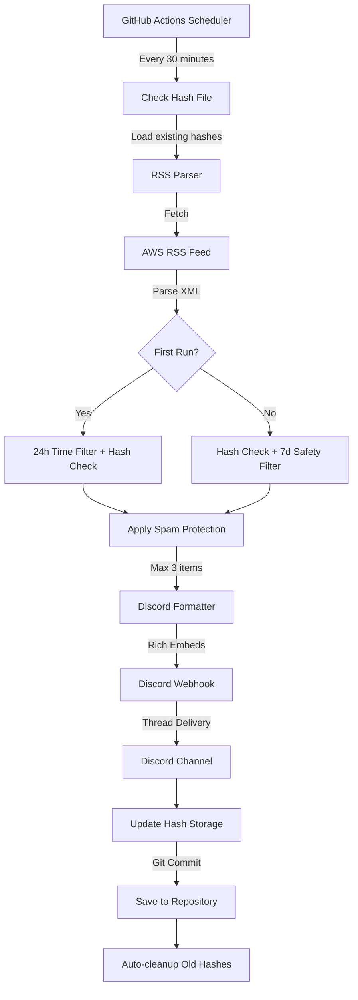

# AWS RSS to Discord Bot


An automated monitoring system that delivers real-time AWS service announcements directly to your Discord server. This bot tracks the official AWS "What's New" RSS feed and sends formatted notifications to a designated Discord thread, ensuring your team stays informed about the latest AWS updates, feature releases, and regional expansions.

## 🌟 Features

### Core Functionality
- **🔄 Automated Monitoring**: Checks AWS RSS feed every 30 minutes via GitHub Actions
- **🎯 Thread-Specific Delivery**: Sends messages to a dedicated Discord thread for organized notifications
- **🚫 Advanced Duplicate Prevention**: Hybrid hash-based + time-window deduplication system
- **📱 Rich Formatting**: Beautiful Discord embeds with AWS branding and metadata
- **🌍 Timezone Support**: Displays timestamps in localized format for better readability
- **📊 Comprehensive Logging**: Detailed execution logs for monitoring and debugging

### Smart Filtering & Protection
- **🔑 Content Hash Deduplication**: SHA256-based unique identification prevents duplicate messages
- **🛡️ Safety Time Windows**: First run (24h) and subsequent runs (7-day safety net)
- **📈 Spam Protection**: Limits maximum 3 items per execution to prevent channel flooding
- **⚡ Rate Limiting**: 2-second delays between messages to respect Discord API limits
- **🔍 Adaptive Filtering**: Different strategies for first run vs. subsequent executions

### Enterprise-Ready
- **💾 Persistent Storage**: Uses Git repository to store sent message hashes across workflow runs
- **🔐 Secure Configuration**: Uses GitHub Secrets for sensitive data management
- **🚨 Robust Error Handling**: Comprehensive error catching with detailed logging
- **📈 Scalable Architecture**: Designed for reliable long-term operation
- **🧹 Auto-cleanup**: Automatically removes hash records older than 7 days
- **🔧 Easy Maintenance**: Self-documenting code with extensive inline documentation

## 📋 Prerequisites

Before setting up this bot, ensure you have:

- **GitHub Account**: For hosting the GitHub Actions workflow
- **Discord Server**: With permission to create webhooks and threads
- **Basic Git Knowledge**: For repository management and configuration

## 🚀 Quick Start

### Step 1: Repository Setup

1. **Fork or Clone this Repository**
   ```bash
   git clone https://github.com/your-username/aws-discord-notifier.git
   cd aws-discord-notifier
   ```

2. **Create the Workflow File**
   - Create directory: `.github/workflows/`
   - Add the workflow file: `aws-rss.yml`
   - Copy the complete workflow code into this file

### Step 2: Discord Configuration

1. **Create a Discord Thread**
   ```
   • Go to your desired Discord channel
   • Send any message (e.g., "AWS Updates Thread")
   • Right-click the message → "Create Thread"
   • Name it: "AWS What's New Updates"
   • Note the thread URL
   ```

2. **Extract Thread ID**
   ```
   From URL: https://discord.com/channels/SERVER_ID/CHANNEL_ID/THREAD_ID
   Copy the THREAD_ID (last number sequence)
   ```

3. **Create Discord Webhook**
   ```
   • Channel Settings → Integrations → Webhooks
   • Create Webhook
   • Name: "AWS Updates"
   • Copy Webhook URL
   ```

### Step 3: GitHub Secrets Configuration

Navigate to your repository: **Settings** → **Secrets and variables** → **Actions**

Add these repository secrets:

| Secret Name | Description | Example Value |
|-------------|-------------|---------------|
| `DISCORD_WEBHOOK_URL` | Discord webhook endpoint | `https://discord.com/api/webhooks/123.../abc...` |
| `THREAD_ID` | Discord thread identifier | `1234567890123456789` |

### Step 4: Repository Permissions

**Important**: Ensure GitHub Actions can commit to your repository:

1. Go to **Settings** → **Actions** → **General**
2. Under **Workflow permissions**, select:
   - ✅ **Read and write permissions**
   - ✅ **Allow GitHub Actions to create and approve pull requests**

### Step 5: Initialize Hash File (Recommended)

To prevent sending old announcements on first run, create an initial hash file:

1. **Create the file**: `sent_messages_hashes.json` in repository root
2. **Option A - Empty Start**: Use `{}` for empty file (will use 24h time filter on first run)
3. **Option B - Pre-populated**: Use the complete hash file provided in this repository to mark all current AWS announcements as "already sent"

### Step 6: Activation

1. **Commit and Push** your workflow file to the repository
2. **Verify Setup**: Go to **Actions** tab and check for the workflow
3. **Manual Test**: Click **Run workflow** to test the setup
4. **Monitor Logs**: Check the execution logs for any errors
5. **Verify Hash File**: After first run, confirm that `sent_messages_hashes.json` is created/updated

## ⚙️ Configuration

### Execution Schedule

The bot runs every 30 minutes by default. To modify the schedule:

```yaml
schedule:
  - cron: '*/30 * * * *'  # Every 30 minutes
  # - cron: '*/15 * * * *'  # Every 15 minutes
  # - cron: '0 * * * *'     # Every hour
```

### Spam Protection Limits

Adjust the maximum items per execution:

```javascript
const MAX_ITEMS_PER_EXECUTION = 3;  // Default: 3 items for safety
```

### Safety Time Windows

Modify the safety thresholds:

```javascript
// First run protection (prevents flooding with old announcements)
const cutoffTime = new Date(now.getTime() - 24 * 60 * 60 * 1000);  // 24 hours

// Subsequent run safety net (prevents sending very old items if hash system fails)
const safetyWindow = new Date(now.getTime() - 7 * 24 * 60 * 60 * 1000);  // 7 days
```

### Hash Cleanup Period

Change how long to keep sent message records:

```javascript
const oneWeekAgo = new Date(Date.now() - 7 * 24 * 60 * 60 * 1000);  // Default: 7 days
```

## 🔧 How It Works

### Architecture Overview


```mermaid
graph TD
    A[GitHub Actions Scheduler] -->|Every 30 minutes| B[Check Hash File]
    B -->|Load existing hashes| C[RSS Parser]
    C -->|Fetch| D[AWS RSS Feed]
    D -->|Parse XML| E{First Run?}
    E -->|Yes| F[24h Time Filter + Hash Check]
    E -->|No| G[Hash Check + 7d Safety Filter]
    F --> H[Apply Spam Protection]
    G --> H
    H -->|Max 3 items| I[Discord Formatter]
    I -->|Rich Embeds| J[Discord Webhook]
    J -->|Thread Delivery| K[Discord Channel]
    K --> L[Update Hash Storage]
    L -->|Git Commit| M[Save to Repository]
    M --> N[Auto-cleanup Old Hashes]
```

### Execution Flow

1. **Scheduled Trigger**: GitHub Actions initiates execution every 30 minutes
2. **Hash Loading**: Loads previously sent message hashes from `sent_messages_hashes.json`
3. **First Run Detection**: Determines if this is the first execution (empty hash file)
4. **RSS Retrieval**: Fetches the latest AWS announcements from the official feed
5. **Adaptive Filtering**: 
   - **First Run**: 24-hour time window + hash check (safety against old announcements)
   - **Subsequent Runs**: Hash check + 7-day safety window (primary deduplication)
6. **Spam Protection**: Limits to maximum 3 items per execution
7. **Message Formatting**: Creates rich Discord embeds with AWS branding
8. **Thread Delivery**: Sends formatted messages to the designated Discord thread
9. **Hash Storage**: Records successful deliveries and commits back to repository
10. **Auto-cleanup**: Removes hash records older than 7 days

### Advanced Duplicate Prevention Strategy

The bot uses a **sophisticated multi-layer deduplication system**:

#### Layer 1: First Run Protection
- **Detection**: Empty or missing hash file indicates first run
- **Strategy**: 24-hour time window to prevent flooding with old announcements
- **Safety**: Ensures first execution only sends recent AWS updates

#### Layer 2: Hash-Based Deduplication (Primary)
- **Method**: SHA256 hash generated from `title + link + publication date`
- **Storage**: Persistent storage in Git repository (`sent_messages_hashes.json`)
- **Coverage**: Remembers all sent messages across workflow executions
- **Efficiency**: O(1) lookup time for duplicate detection

#### Layer 3: Safety Time Window (Backup)
- **Purpose**: Backup protection against very old items (7+ days)
- **Trigger**: Activated even in subsequent runs as safety net
- **Scenario**: Protects against hash file corruption or system failures

#### Hash File Structure
```json
{
  "535ee5c1c3602c62": "2025-07-27T13:08:58.119Z",
  "abc123def4567890": "2025-07-28T10:30:00.000Z",
  "xyz789uvw1234567": "2025-07-28T14:15:00.000Z"
}
```

**Key**: 16-character SHA256 hash of content  
**Value**: ISO timestamp when message was successfully sent to Discord

## 📊 Expected Behavior

### First Run Scenario
```
🚀 FIRST RUN DETECTED: Using 24-hour time filter for safety
⏰ First run cutoff time: 2025-07-26T14:00:00.000Z
📄 Evaluating: "AWS Transfer Family (yesterday)..."
   ✨ FIRST RUN QUALIFIED! Age: 12 hours
📄 Evaluating: "Amazon Connect (3 days ago)..."
   ⏰ FILTERED OUT: Age: 72 hours (first run protection)
🎯 Filtering complete: 1-3 new items qualify for Discord delivery
💾 Saved 3 hash records to storage
```

### Subsequent Run (Normal Operation)
```
🔄 SUBSEQUENT RUN: Using hash + time safety filter
📚 Loaded 25 hash records from storage
📄 Evaluating: "AWS Transfer Family..."
   🚫 DUPLICATE DETECTED: Already sent on 2025-07-27T13:08:58.119Z
📄 Evaluating: "New AWS Service..."
   ✨ NEW ITEM QUALIFIED! Age: 2 hours (hash not found)
📄 Evaluating: "Very Old Announcement (10 days)..."
   🛡️ SAFETY FILTERED: Age: 10 days (exceeds 7-day safety window)
🎯 Filtering complete: 1 new items qualify for Discord delivery
```

### High-Activity Periods
```
📈 AWS Conference Days (re:Invent):
├── Multiple announcements detected
├── Hash-based deduplication prevents duplicates
├── Spam protection limits to 3 items per execution
├── Remaining items processed in subsequent runs
├── All successful deliveries tracked in hash file
└── No Discord channel flooding
```

### Hash File Evolution
```
📈 Hash File Growth Over Time:
├── Day 1: 3 hashes (first announcements)
├── Day 2: 7 hashes (4 new announcements)
├── Day 7: 25 hashes (active week)
├── Day 8: 22 hashes (auto-cleanup removes day 1 entries)
├── Day 14: 20-30 hashes (steady state)
└── Long-term: ~15-35 hashes typically (rolling 7-day window)
```

## 🐛 Troubleshooting

### Common Issues

#### No Messages Received
**Symptoms**: Workflow runs successfully but no Discord messages appear

**Diagnostic Steps**:
1. Check workflow logs for `✅ Successfully delivered to Discord` messages
2. Verify Discord webhook URL is correct and active
3. Confirm thread ID matches your Discord thread
4. Review spam protection logs - items might be filtered

**Solutions**:
1. Test Discord webhook manually using a tool like curl
2. Regenerate webhook URL if needed
3. Verify thread permissions and webhook scope
4. Check if all items are being filtered by hash/time windows

#### Duplicate Messages Appearing
**Symptoms**: Same announcement appears multiple times despite hash system

**Diagnostic Steps**:
1. Check if `sent_messages_hashes.json` exists and is being updated
2. Review "Commit hash file" step logs for git errors
3. Verify repository write permissions
4. Look for error messages in hash file operations

**Solutions**:
1. **Repository Permissions**: Settings → Actions → General → "Read and write permissions"
2. **Manual Hash File Creation**: Create empty `{}` file if missing
3. **Branch Protection**: Ensure GitHub Actions can push to main branch
4. **File Corruption**: Reset hash file if corrupted

#### Hash File Not Created/Updated
**Symptoms**: `sent_messages_hashes.json` remains empty, missing, or unchanged

**Diagnostic Steps**:
```bash
# Look for these log patterns:
💾 Saved X hash records to storage
📁 Hash file found, checking contents...
💾 Committing hash file changes...
✅ Successfully pushed hash file to repository
```

**Solutions**:
1. **Check Git Permissions**: Verify Actions can write to repository
2. **Review Commit Logs**: Look for git push failures
3. **Manual Initialization**: Create initial hash file with current announcements
4. **Debug Mode**: Add additional logging to track file operations

#### Missing Recent Announcements
**Symptoms**: New AWS announcements don't appear in Discord

**Diagnostic Steps**:
1. Check if announcements fall within time windows
2. Review RSS feed accessibility in logs
3. Verify hash generation and storage processes
4. Look for spam protection activation

**Solutions**:
1. Adjust safety time windows if too restrictive
2. Verify AWS RSS feed URL accessibility
3. Check Discord API rate limiting
4. Review spam protection thresholds

### Debug Mode

Enable enhanced logging by modifying the script:

```javascript
// Add after hash loading
console.log('🔍 Debug: Loaded hashes count:', Object.keys(sentHashes).length);
console.log('🔍 Debug: First run detection:', isFirstRun);

// Add after each item evaluation
console.log('🔍 Debug: Item evaluation details:', {
  title: item.title.substring(0, 30),
  hash: contentHash,
  published: item.pubDate,
  age: ageCalculation
});

// Add before Discord delivery
console.log('🔍 Debug: Final items to process:', newItems.map(i => i.contentHash));
```

### Log Analysis

Monitor these key log patterns:

**Successful Operation**:
- `📚 Loaded X hash records from storage`
- `🔄 SUBSEQUENT RUN: Using hash + time safety filter`
- `✨ NEW ITEM QUALIFIED! Age: X hours (hash not found)`
- `✅ Successfully delivered to Discord`
- `💾 Saved X hash records to storage`

**Duplicate Prevention Working**:
- `🚫 DUPLICATE DETECTED: Already sent on [timestamp]`
- `🛡️ SAFETY FILTERED: Age: X days (exceeds 7-day safety window)`

**Potential Issues**:
- `❌ CRITICAL ERROR`: System-level failures requiring attention
- `Failed to push to repository`: Git permission issues
- `No changes to commit`: Hash file not being updated
- `ReferenceError`: Code errors in script execution

## 🔒 Security Considerations

### Secret Management
- **Never commit secrets** to the repository
- **Use GitHub Secrets** for all sensitive configuration
- **Regularly rotate** Discord webhook URLs if compromised
- **Review access permissions** periodically

### Repository Security
- **Monitor hash file commits** for unusual activity
- **Review workflow permissions** regularly
- **Use branch protection** if needed (with Actions bypass)
- **Audit repository access** periodically

### Webhook Security
- **Limit webhook scope** to specific channels only
- **Monitor webhook usage** through Discord audit logs
- **Revoke unused webhooks** to reduce attack surface

## 📈 Performance & Limits

### GitHub Actions Quotas
- **Public Repositories**: Unlimited GitHub Actions minutes
- **Private Repositories**: 2,000 minutes/month (free tier)
- **Current Usage**: ~1-2 minutes per month for this workflow

### Discord API Limits
- **Webhook Rate Limit**: 30 requests per minute
- **Our Implementation**: 1 request per 2 seconds (well under limit)
- **Message Size Limit**: 2000 characters (our embeds: ~800 characters)

### Storage Efficiency
- **Hash File Size**: Typically 1-8KB (very lightweight)
- **Git History Impact**: ~1KB per commit (minimal)
- **Auto-cleanup**: Prevents unbounded growth
- **Long-term Stability**: File size remains constant after initial period

## 🔄 Maintenance

### Regular Tasks
- **Monitor workflow runs** for consistent execution
- **Review Discord channel** for message delivery
- **Check repository commits** for hash file updates
- **Verify webhook functionality** periodically

### Updating the Bot
1. **Backup current hash file** before major updates
2. **Test changes** with manual workflow runs
3. **Monitor logs** after updates for new issues
4. **Update documentation** for any configuration changes

### Hash File Management
- **Normal Operation**: No manual intervention required
- **Reset System**: Delete hash file to restart (will use 24h filter)
- **Bulk Initialize**: Use provided complete hash file to mark all current announcements
- **Troubleshooting**: Check git history for hash file evolution

## 📝 License

This project is licensed under the MIT License - see the [LICENSE](LICENSE) file for details.

*Stay updated with the latest AWS announcements effortlessly - no duplicates, no spam, just the news you need!*
